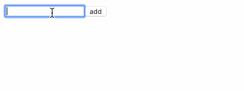

# [Uncontrolled form | Flux-architecture and Redux](https://fullstackopen.com/en/part6/flux_architecture_and_redux#uncontrolled-form)

React + Redux の利用したシンプルなノートアプリケーション。



[part6-2](../part6-2)に以下の機能を追加したもの。

- メモを追加する
- メモの important をトグルする

## セットアップ

```shell
$ yarn start
```

## アプリケーションを development mode で起動

```shell
$ yarn start
```

## テストを実行

```shell
$ yarn test
```
