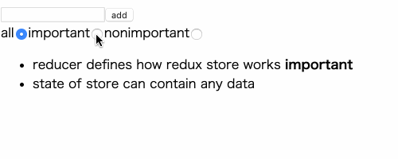

# [Many reducers, connect](https://fullstackopen.com/en/part6/many_reducers_connect)

React + Redux の利用したシンプルなノートアプリケーション。



[part6-3](../part6-3)に以下の機能を追加したもの。

- メモをフィルタリングする

## セットアップ

```shell
$ yarn start
```

## アプリケーションを development mode で起動

```shell
$ yarn start
```

## テストを実行

```shell
$ yarn test
```
